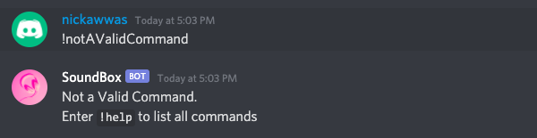

# SoundBox
Implemented a Music Bot using DiscordJS and YouTube API

## Documentation
Prefix (!) - Used to Initiate Command

`!p , !play [query]` - Play YouTube Videos\
`!q, !queue [query]` - Adds Video to Queue

`!af, !adfav [query]` - Ads a Video To Favorites List\
`!f, !fav [query]` - Plays a Favorite YouTube Video\
`!dl, !download [query]` - Converts and Downloads YouTube Video to MP3

`!pa, !pause` - Pauses Currently Playing Video\
`!r, !resume` - Resumes Currently Paused Video\
`!s, !skip` - Skip Current Video to Next in Queue

`!h, !help` - Lists All Commands

## Usage
Play Music Using the `!play` Command Followed By What You Want To Play\

Pause and Resume Music Using the `!pause` and `!resume` Commands\

Skip a Song and Play the Next One in Queue Using the `!skip` Command\

Add a Song to Queue Using the `!queue` Command\

Add a Song to Favorites Using the `!adfav` Command\
Add a Favorite Song to Queue Using `!fav` Command\

Must Enter a Valid Command\

List of All Commands Using the `!help` Command\
