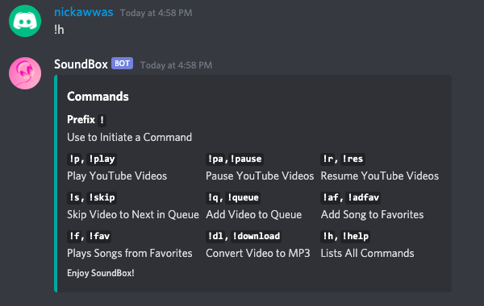

# SoundBox
Implemented a Music Bot using DiscordJS and YouTube API

## Documentation
Prefix (!) - Used to Initiate Command

`!p , !play [query]` - Play YouTube Videos\
`!q, !queue [query]` - Adds Video to Queue

`!af, !adfav [query]` - Ads a Video To Favorites List\
`!f, !fav [query]` - Plays a Favorite YouTube Video

`!pause` - Pauses Currently Playing Video\
`!r, !res` - Resumes Currently Paused Video\
`!s, !skip` - Skip Current Video to Next in Queue

`!h, !help` - Lists All Commands

## Screenshots
Playing Music in a Voice Channel\

Adding Songs to Queue\

Must Enter a Valid Command\

List of All Commands\
